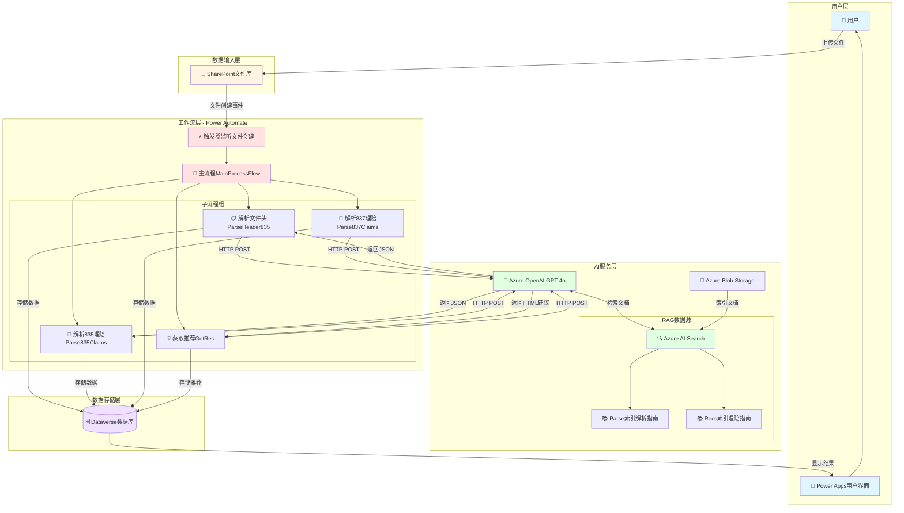
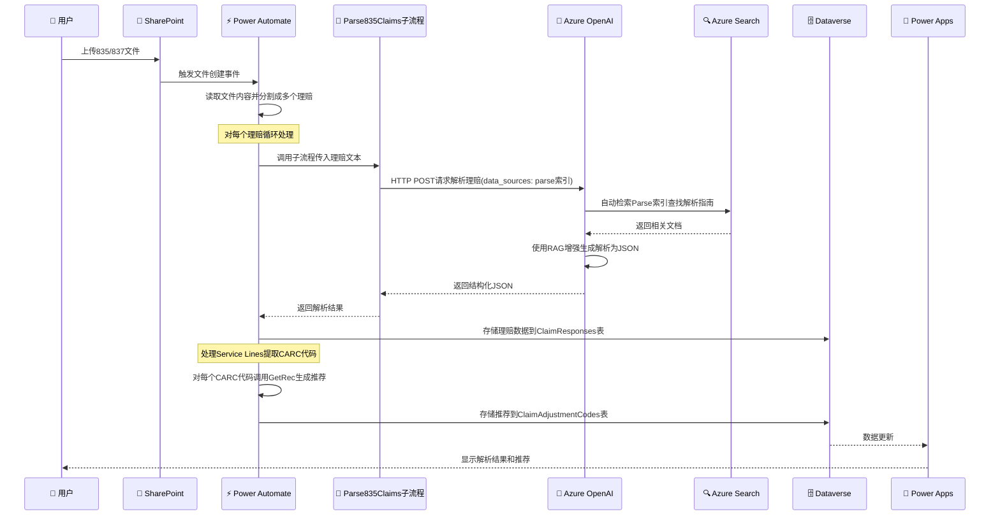
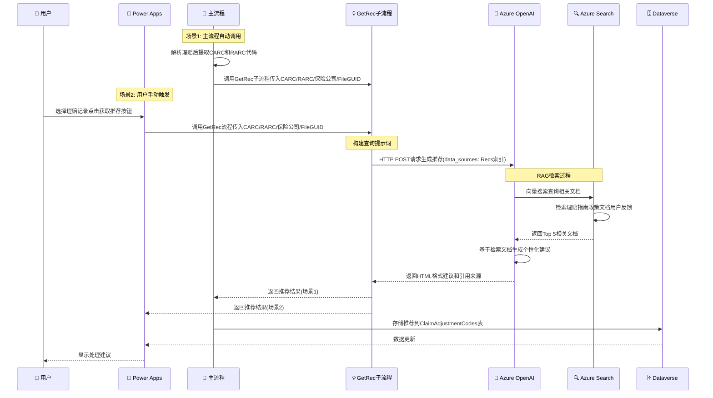
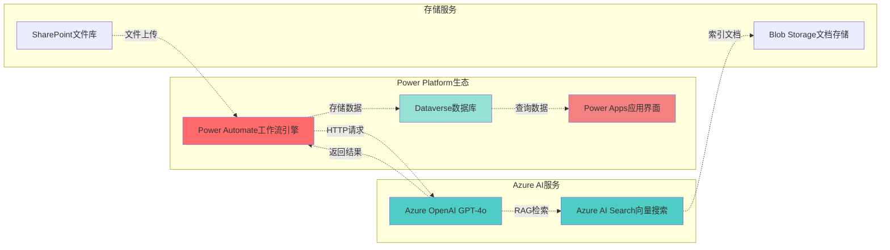
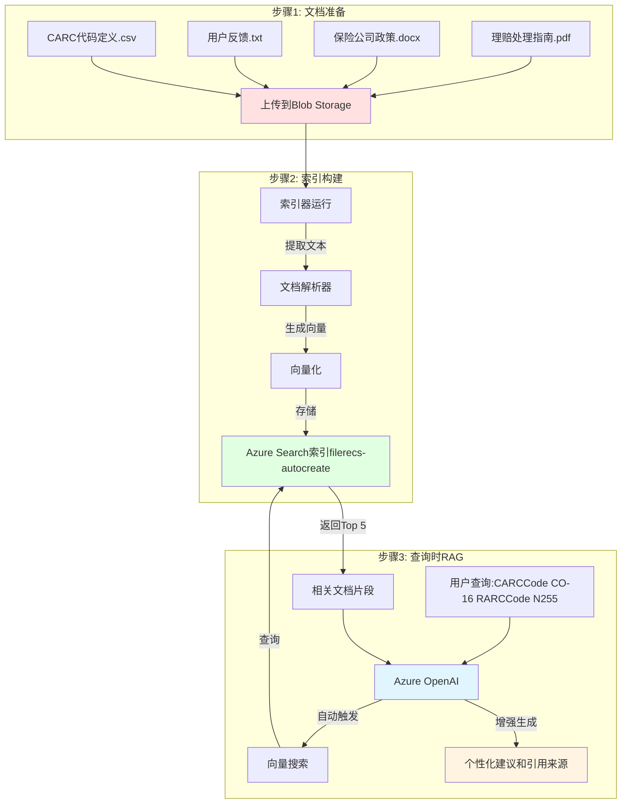
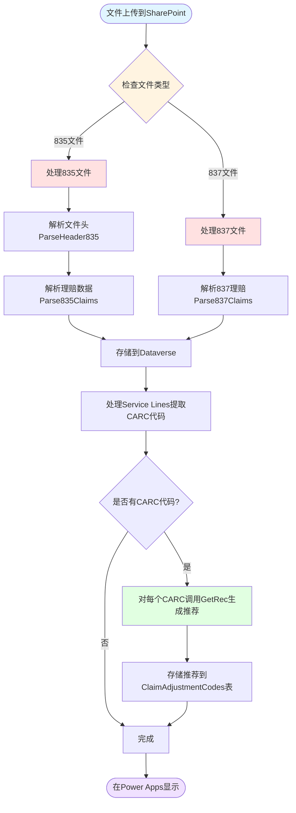
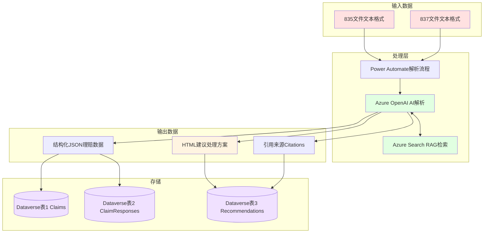
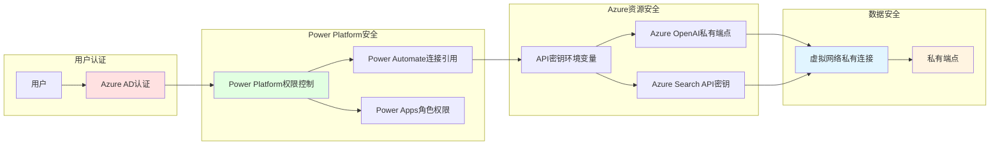
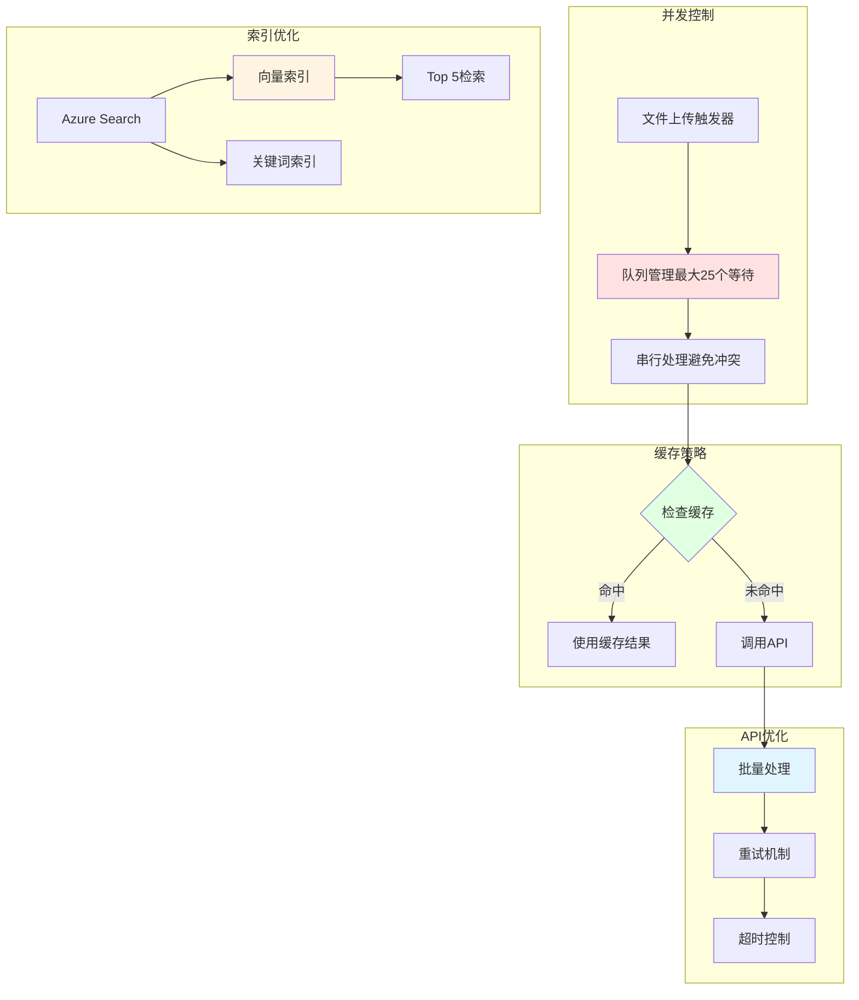

# RHAIL Claims Denial Navigator 系统架构可视化

## 🏗️ 整体系统架构图

## 🔄 详细数据流程图

### 流程1: 文件解析流程

### 流程2: 推荐生成流程

## 🧩 组件交互图

## 📊 RAG工作原理详解

## 🔀 主流程决策树

## 🗂️ 数据流架构

## 🔐 安全与访问控制

## 📈 性能优化流程

## 🎯 关键区别对比

```mermaid
graph TB
    subgraph "传统LLM架构"
        T1[用户输入] --> T2[MCP服务器]
        T2 --> T3[工具调用]
        T3 --> T4[LLM处理]
        T4 --> T5[输出结果]
    end
    
    subgraph "本项目RAG架构"
        P1[文件上传] --> P2[Power Automate]
        P2 --> P3[Azure OpenAI]
        P3 --> P4[自动RAG检索]
        P4 --> P5[Azure Search]
        P5 --> P6[文档增强]
        P6 --> P7[生成结果]
        P7 --> P8[存储到Dataverse]
    end
    
    style T2 fill:#ffcccc
    style P2 fill:#ccffcc
    style P4 fill:#cceeff
    style P5 fill:#cceeff
```

---

## 📝 图例说明

- 🔵 **蓝色**: 用户界面和交互
- 🟡 **黄色**: 数据输入和存储
- 🔴 **红色**: 工作流和处理逻辑
- 🟢 **绿色**: AI服务和RAG
- 🟣 **紫色**: 数据库和持久化

## 💡 关键要点

1. **不是MCP架构**: 使用Power Automate + RAG模式
2. **自动化流程**: 从文件上传到结果展示全自动
3. **RAG增强**: Azure Search提供上下文文档
4. **低代码平台**: 基于Power Platform，易于维护
5. **企业级集成**: 与Microsoft生态系统深度集成
